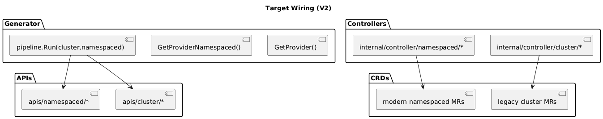

# Phase 3: Dual-Scope Layout

## Goal

Generate both cluster and namespaced APIs/controllers.

## Key Files

- `apis/` -> split into `apis/cluster` and `apis/namespaced`
- `internal/controller/` -> split `cluster` and `namespaced`
- `config/` -> add `cluster/*` and `namespaced/*`
- `config/provider.go`
- `cmd/generator/main.go`

## Steps

1. Move current APIs/controllers into `cluster` layout.
2. Create namespaced mirrors for root API/version and manual files.
3. Add `GetProviderNamespaced()` with root group `oci.m.upbound.io`.
4. Update generator:
```go
pipeline.Run(config.GetProvider(), config.GetProviderNamespaced(), absRootDir)
```
5. Regenerate and confirm directories are created.

## Diagram



## Exit Criteria

- [ ] `apis/cluster` and `apis/namespaced` exist
- [ ] `internal/controller/cluster` and `internal/controller/namespaced` exist
- [ ] both provider configs passed to pipeline
