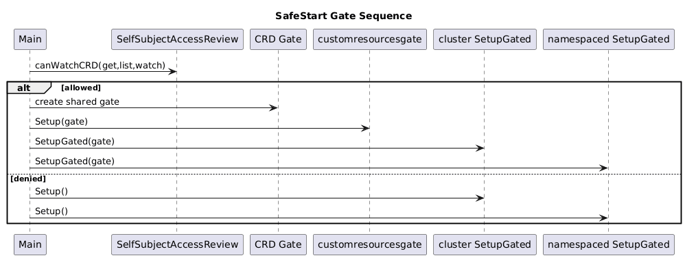

# Phase 5: SafeStart + Gated Controllers

## Goal

Gate controller startup on CRD readiness when RBAC allows.

## Key Files

- `hack/main.go.tmpl`
- `cmd/provider/*/zz_main.go` (generated)
- `internal/controller/cluster/**`
- `internal/controller/namespaced/**`
- `package/crossplane.yaml.tmpl`

## Steps

1. Add `canWatchCRD()` precheck (`SelfSubjectAccessReview`).
2. Wire shared `Gate[schema.GroupVersionKind]`.
3. Add `SetupGated()` for providerconfig and generated setup files.
4. Fallback to normal `Setup()` when RBAC check fails.
5. Add package capability:
```yaml
spec:
  capabilities:
  - SafeStart
```

## Diagram



## Exit Criteria

- [ ] gated setup functions exist
- [ ] mains use gate path + fallback path
- [ ] package metadata includes `SafeStart`
