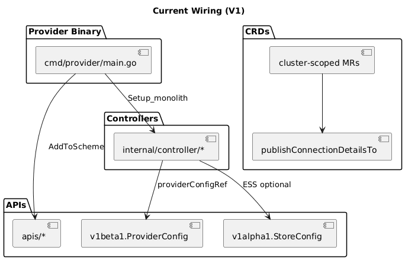
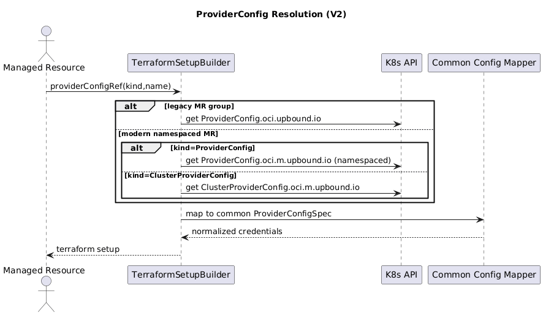
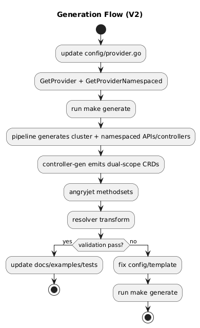

# OCI Upjet V2 Migration Plan

Use this folder as the execution runbook.

## Order

1. [01-preflight.md](./01-preflight.md)
2. [02-phase-1-baseline-and-v2-deps.md](./02-phase-1-baseline-and-v2-deps.md)
3. [03-phase-2-remove-ess.md](./03-phase-2-remove-ess.md)
4. [04-phase-3-dual-scope-layout.md](./04-phase-3-dual-scope-layout.md)
5. [05-phase-4-providerconfig-modernization.md](./05-phase-4-providerconfig-modernization.md)
6. [06-phase-5-safestart-gating.md](./06-phase-5-safestart-gating.md)
7. [07-phase-6-regenerate-validate-docs.md](./07-phase-6-regenerate-validate-docs.md)
8. [08-phase-7-rollout.md](./08-phase-7-rollout.md)

## Diagram Previews

### 1) Current Wiring

### 2) Target Wiring

### 3) ProviderConfig Resolution

### 4) SafeStart Sequence

### 5) Generation Flow

## Diagram Source (Optional)

- [diagrams/01-current-wiring.puml](./diagrams/01-current-wiring.puml)
- [diagrams/02-target-wiring.puml](./diagrams/02-target-wiring.puml)
- [diagrams/03-providerconfig-resolution.puml](./diagrams/03-providerconfig-resolution.puml)
- [diagrams/04-safestart-sequence.puml](./diagrams/04-safestart-sequence.puml)
- [diagrams/05-generation-flow.puml](./diagrams/05-generation-flow.puml)

## Execution Rule

Do not start next phase until current phase exit criteria is green.
